# Banking Application

This is a banking application developed using Spring for the backend and Angular for the frontend. The application includes features such as user authentication, internationalization, and secure banking operations.

## Features

- **User Authentication**: Implemented login functionality with security measures to protect user data.
- **Internationalization**: The application supports multiple languages using properties files in the backend, allowing users to interact with the application in their preferred language.

## Backend Details

The backend is developed with Spring Boot and includes the following:

- **Properties for Internationalization**: The application uses properties files (e.g., `messages.properties`, `messages_fr.properties`, etc.) to manage text and messages in different languages. This allows the application to dynamically serve content based on the user's language preference.
  
- **REST API Endpoint**: An endpoint has been created to fetch localized messages from the backend, which can be linked to the frontend. This endpoint provides the necessary translations based on the user's selected language.
- 
## How i implementeed Internationalization


### Backend Implementation (Spring)

1. **Properties Files**:
   - Created separate properties files for each supported language in the `src/main/resources` directory:
     - `messages.properties` (default language, e.g., English)
     - `messages_fr.properties` (French)
     - `messages_es.properties` (Spanish)
   - Each properties file contains key-value pairs where the key represents a message identifier and the value is the translated message. 
     - Example:
       ```properties
       # messages.properties
       welcome.message=Welcome to our Banking Application
       
       # messages_fr.properties
       welcome.message=Bienvenue dans notre application bancaire
       ```

2. **LocaleResolver**:
   - Configured a `LocaleResolver` in the Spring application to determine the current locale based on user preferences or request headers, enabling the application to serve the appropriate language based on user settings or browser language.

3. **REST Endpoints**:
   - Created REST endpoints to retrieve messages based on the user's locale. When the frontend requests a specific message, the backend uses the properties files to return the appropriate translated string.

### Frontend Implementation (Angular)

1. **HTTP Client**:
   - Utilized the Angular HTTP client to make requests to the backend for localized messages. The frontend dynamically updates the UI with these messages based on the user's selected language.

2. **Language Selection**:
   - Implemented a language selection feature, allowing users to choose their preferred language from a dropdown menu. Upon selection, the Angular application updates the current locale and requests the appropriate messages from the Spring backend.


Partie Realisation
page custumor

cas de suppression

cas de filtrage
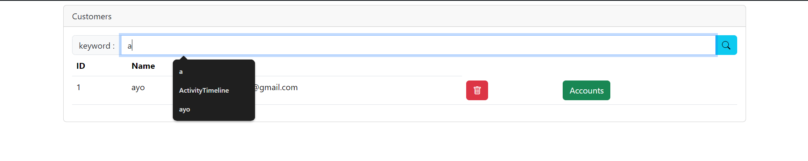
new custumor

page account
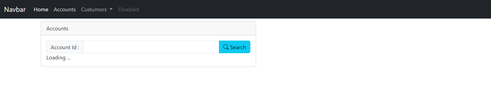

puis on le saisie dans le champ de recherche

pour faire le debit
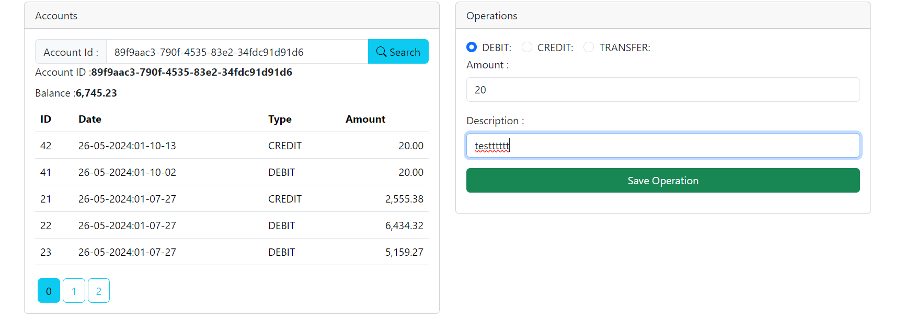
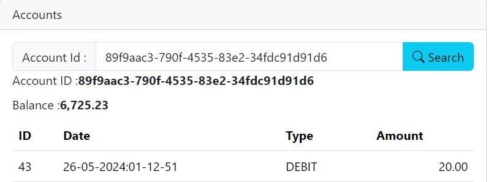
pour faire le credit


pour faire le virement
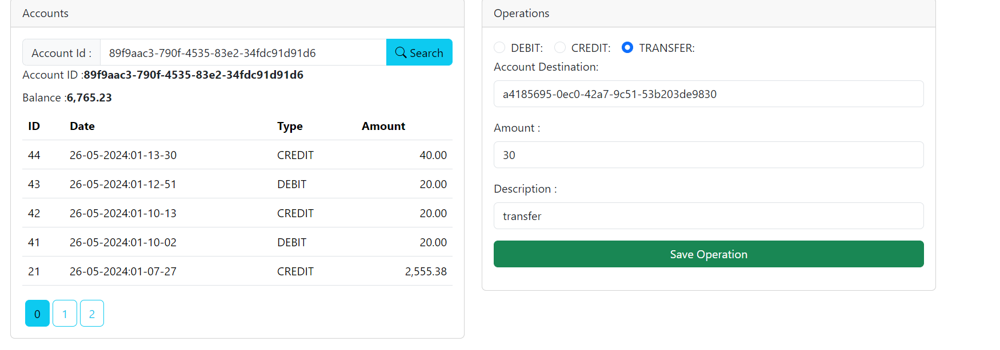
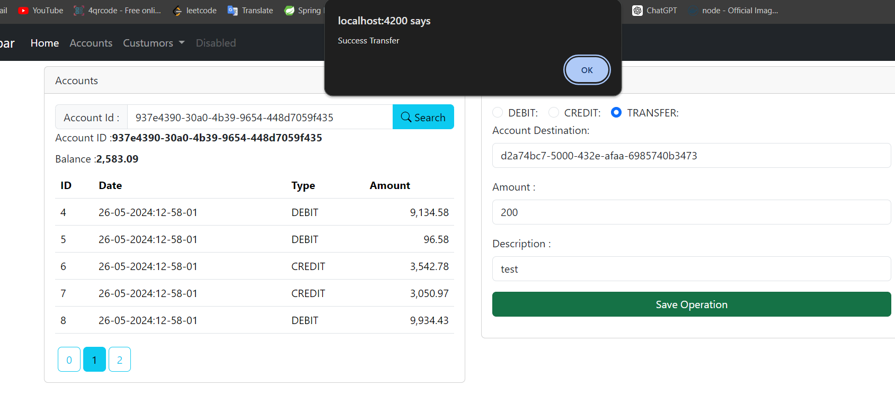
<h2>

page login 
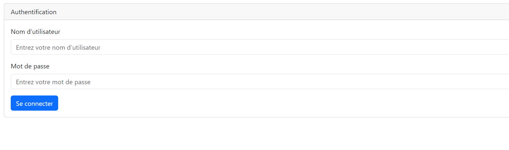
en cas user
on peut pas ajouter un custumor

on peut juste consullter ,les accounts 
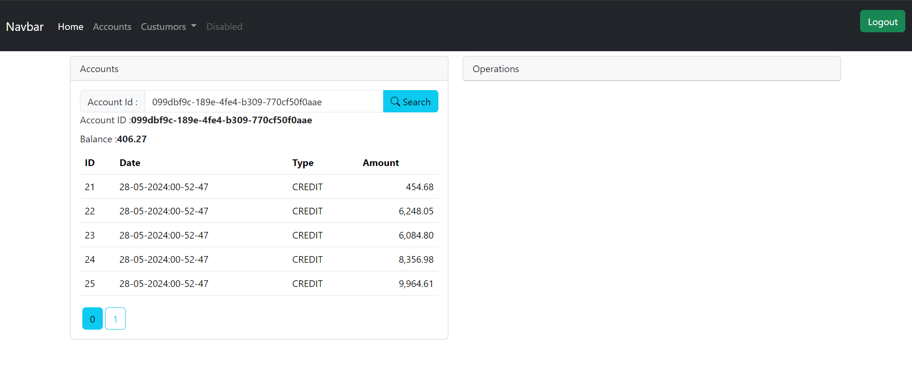
en cas admin
on peut ajouter et consulter  un custumor
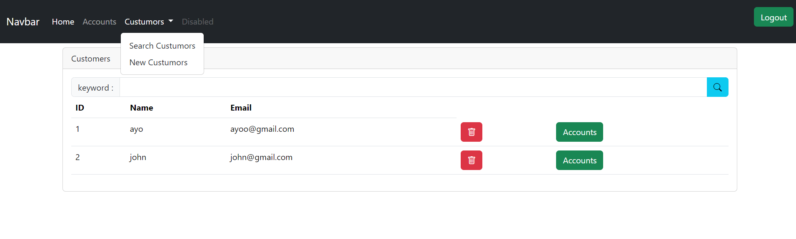
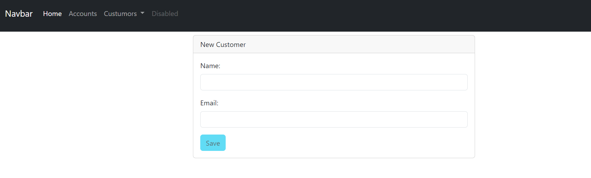
on peut faire des operations sur les accounts
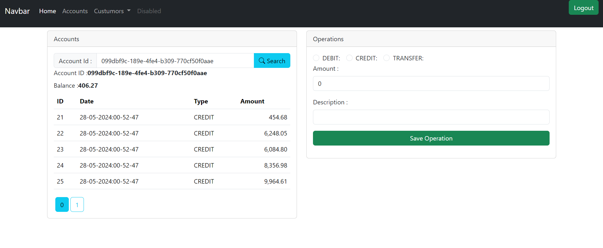
***********


et on peut faire logout

**************

on cas de la non authorization on a cette page

ici affiche l utilisateur connecté


